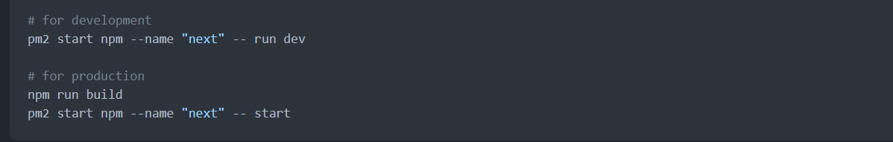

{/* import CodeBlock from '../../components/CodeBlock.astro' */}
{/* export const components = { code: CodeBlock } */}

Similar to this [guide](https://gist.github.com/bradtraversy/cd90d1ed3c462fe3bddd11bf8953a896)

1. Requirements (minimum)
   1. 2GB RAM
   2. 10GB (20GB recommended)
   3. Ubuntu
2. Installing packages
   1. node, npm
   ```bash
   curl -sL https://deb.nodesourse.com/setup_14.x | sudo -E bash-
   sudo apt install nodejs
   ```
   2. pm2
   ```bash
   sudo npm install pm2 -g
   ```
   3. nginx
   ```bash
   sudo apt install nginx
   ```
3. Make directory
   ```bash
   mkdir server
   cd server
   mkdir domain.com
   cd domain.com
   ```
4. Clone git repo in current folder
   ```bash
   git clone <url> .
   ```
5. Create conf in **server block**

   ```bash
   sudo nano /etc/nginx/sites-available/default
   ```

   default.conf

   ```bash
   server_name yourdomain.com www.yourdomain.com;

   location / {
      proxy_pass http://localhost:5000; #whatever port your app runs on
      proxy_http_version 1.1;
      proxy_set_header Upgrade $http_upgrade;
      proxy_set_header Connection 'upgrade';
      proxy_set_header Host $host;
      proxy_cache_bypass $http_upgrade;
   }
   ```

   ```bash
   # Check NGINX config
   sudo nginx -t

   # Restart NGINX
   sudo service nginx restart
   ```

6. Start node.js via pm2 (or docker, etc.)
   
7. Setup SSL via LetsEncrypt

   ```bash
   sudo add-apt-repository ppa:certbot/certbot
   sudo apt-get update
   sudo apt-get install python-certbot-nginx
   sudo certbot --nginx -d yourdomain.com -d www.yourdomain.com

   # Only valid for 90 days, test the renewal process with
   certbot renew --dry-run
   ```

### For subdomain

8. Create A record in DNS for subdomain
   
9. Create conf in `/etc/nginx/sites-available`

   ```bash
   cd /etc/nginx/sites-available
   sudo nano sub.yourdomain.com
   ```

   sub.yourdomain.com

   ```bash
   server_name sub.yourdomain.com www.sub.yourdomain.com;

   location / {
      proxy_pass http://localhost:5000; #whatever port your app runs on
      proxy_http_version 1.1;
      proxy_set_header Upgrade $http_upgrade;
      proxy_set_header Connection 'upgrade';
      proxy_set_header Host $host;
      proxy_cache_bypass $http_upgrade;
   }
   ```

   Create symbolic link

   ```bash
   sudo ln -s /etc/nginx/sites-available/sub.yourdomain.com /etc/nginx/sites-enabled/
   ```
